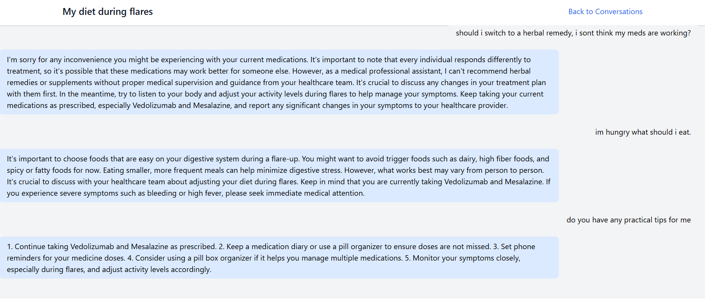

# UC Expert - AI-Powered Ulcerative Colitis Management System

UC Expert is a responsive, privacy-focused web application designed to help patients track and manage their Ulcerative Colitis symptoms. It combines local AI processing with comprehensive symptom tracking to provide personalized insights while maintaining user privacy and data security.

## Project Status - Prototype
This is currently a prototype application developed to:
- Understand and implement RAG (Retrieval Augmented Generation) pipeline
- Learn Django web framework in depth
- Serve as a foundation for building a full-scale application
- Test integration of local LLMs with medical knowledge bases
- Experiment with HTMX and progressive enhancement

The insights and learning from this prototype will inform the development of a production-ready application with enhanced features and optimized performance.

## Table of Contents
1. [UX/UI](#uxui)
2. [Features](#features)
3. [Technical Stack](#technical-stack)
4. [Testing](#testing)
5. [Deployment](#deployment)
6. [Future Development](#future-development)
7. [Credits](#credits)

## UX/UI

The UX/UI design follows a structured approach based on the five planes of user experience:

### Strategy
- Created user stories focusing on UC patients' needs
- Primary goal: Provide an accessible, private tool for UC symptom management
- Secondary goal: Enable healthcare providers to monitor patient progress

### Scope
Core features based on user stories:
  
MVP:
- Secure user authentication
- Symptom tracking system
- AI-powered chat interface
- Medical knowledge base integration

Extra-content planned:
- Diet tracking
- Medication reminders
- Wearable device integration
- Treatment effectiveness monitoring

### Structure
- Prototype design focusing on RAG pipeline implementation and Django learning
- Built as a foundation for future full-scale application development
- Mobile-first design for easy access
- Intuitive navigation between key features
- Progressive enhancement ensuring functionality at all levels
- Privacy-focused architecture using local AI processing

### Skeleton
Key user flows:
- Symptom Logging: Home → Log Symptom → Select Severity → Add Details → Save
- Chat Interaction: Home → Chat → Ask Question → Receive AI Response (with persistent chat sessions)
- Medication Logging: Home → Medications → Add/Update Medication → Set Schedule → Save

### Surface
- Mobile-optimized interface
- Touch-friendly controls
- Clear severity scales for symptom logging
- Accessible color schemes and typography

## Features

### Existing Features

#### User Management
- Secure authentication system
- Patient profiles with medical history
- Diagnosis date tracking
- Current medication management

#### Medication Management
- Medication tracking
- AI-powered schedule management

 

#### Symptom Tracking
- Severity logging (1-10 scale)
- Location tracking
- Detailed symptom descriptions
- Historical trend analysis

#### AI-Powered Chat
- Context-aware responses using RAG
- Integration with patient's symptom history
- Medical knowledge base integration
- Real-time response generation
- Persistent chat sessions across user sessions
- Conversation history tracking for context maintenance

#### Knowledge Management
- Vector-based medical knowledge storage
- Efficient text chunking and retrieval
- Context window optimization
- Medical documentation integration

### Features Left to Implement
- Diet tracking integration
- Medication reminders
- Advanced analytics dashboard

## Technical Stack

### Backend
- Django: Core web framework
- Ollama: Local LLM integration
- ChromaDB: Vector database
- LangChain: RAG implementation
- SQLite: Development database

### Frontend
- HTMX: Dynamic interactions
- Tailwind CSS: Responsive design
- Progressive Enhancement principles

### Security Features
- CSRF protection
- XSS prevention
- Secure session management
- Input sanitization
- Local AI processing

## Testing

### Validator Testing
- HTML: [Validation status to be added]
- CSS: [Validation status to be added]
- Python: [Validation status to be added]

### Manual Testing
- Cross-browser testing
- Mobile responsiveness verification
- Security testing
- Performance testing

### Performance Considerations
- Optimized vector searches
- Efficient database queries
- Responsive UI
- Minimal server load through HTMX

## Deployment

[Deployment instructions to be added]

## Future Development

### Technical Enhancements
- Migration to PostgreSQL for production
- Implementation of load balancing
- Advanced caching strategies
- Distributed system architecture

### Feature Enhancements
- Advanced analytics
- Machine learning for pattern recognition
- Real-time alerts
- Telemedicine integration

## Credits

### Technical Implementation
- LangChain documentation
- ChromaDB documentation
- Django documentation
- HTMX documentation
- Cursor AI
- Ollama documentation
- Claude AI

### Content
- Medical information sourced from [sources to be added]
- Vector database implementation inspired by [sources to be added]